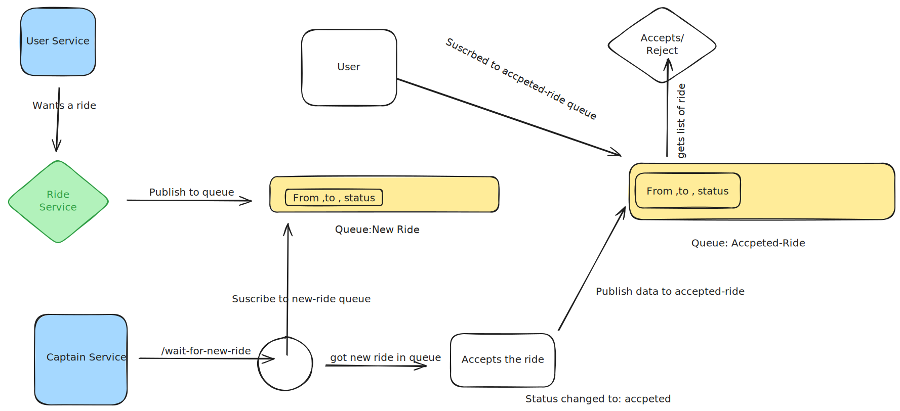

# Ride Share Backend

This is a backend service for a ride-sharing application. It is built using Node.js, Express, MongoDB, and RabbitMQ. The project is divided into three main services: User, Captain, and Ride, with a Gateway to route requests to the appropriate service.

## Architecture Diagram

### User Service

Handles user registration, login, profile management, and ride acceptance.

- **Port:** 3001

### Captain Service

Handles captain registration, login, profile management, and ride availability.

- **Port:** 3002

### Ride Service

Handles ride creation and acceptance.

- **Port:** 3003

### Gateway

Routes requests to the appropriate service.

- **Port:** 3000
 
## Working

1. **User Registration and Login:**
   - Users can register and log in to the application. Passwords are hashed using bcrypt, and JWT tokens are used for authentication.

2. **Captain Registration and Availability:**
   - Captains can register, log in, and toggle their availability status. Captains can also wait for new ride requests.

3. **Ride Creation and Acceptance:**
   - Users can create ride requests, which are then published to a RabbitMQ queue. Captains can accept these ride requests, and the status is updated accordingly.

4. **Event-Driven Communication:**
   - The services communicate with each other using RabbitMQ for event-driven communication. For example, when a ride is created, an event is published to the queue, and captains waiting for new rides are notified.

## Highlights

- **Microservices Architecture:** The project is divided into multiple services, each handling a specific domain.
- **Event-Driven Communication:** RabbitMQ is used for communication between services, ensuring loose coupling and scalability.
- **JWT Authentication:** Secure authentication using JWT tokens.
- **Long Polling:** Implemented long polling for real-time updates on ride acceptance.
- **Scalability:** Each service can be scaled independently based on the load.

